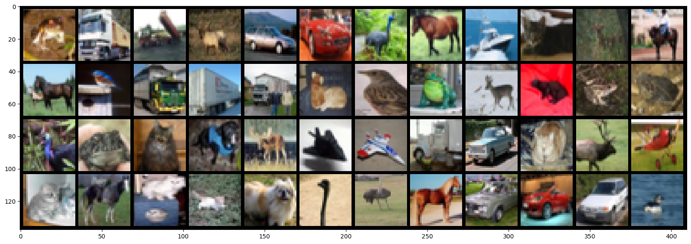
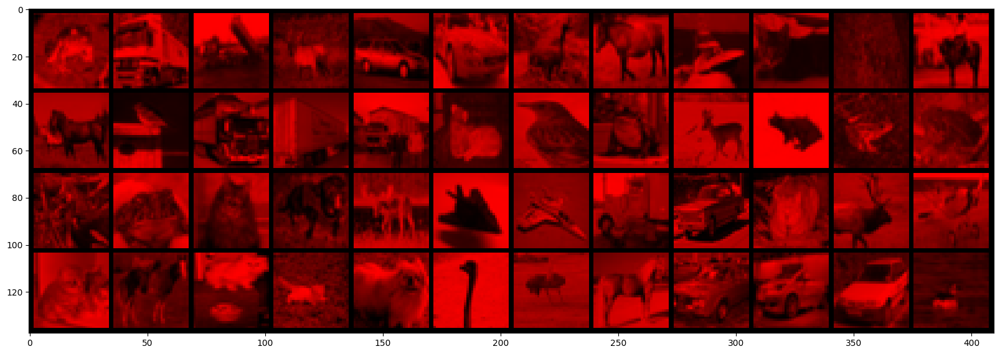

<a href="https://colab.research.google.com/github/Nabal22/deep-learning-101/blob/main/2-basics/tensors.ipynb" target="_parent"></a>

# Tensors, vectorization, broadcast
_Adapted from [Dataflowr](https://dataflowr.github.io) by Marc Lelarge_

## System setup

Import the required packages, check the current version of PyTorch, and check that GPU is available (on Colab you may need to change the runtime first).


```python
import matplotlib.pyplot as plt
%matplotlib inline
import torch
import numpy as np

print(f"{torch.__version__=}")
```

    torch.__version__='2.10.0+cu128'


## Back to Basics: Tensors

Tensors are used to encode the signal to process, but also the internal states and parameters of models.

**Manipulating data through this constrained structure allows to use CPUs and GPUs at peak performance.**

In PyTorch, a Tensor is similar to numpy NDArray: a multidimensional array containing data **of the same type**.

### Tensor Construction Functions

PyTorch provides several functions to create tensors. Let's start with the most common ones for 1D arrays.

#### Creating tensors filled with constant values

The most basic constructors create tensors filled with zeros, ones, or uninitialized values.


```python
# Reference tensor
print(torch.zeros(10))
print(torch.ones(12))
print(torch.empty(3))
```

    tensor([0., 0., 0., 0., 0., 0., 0., 0., 0., 0.])
    tensor([1., 1., 1., 1., 1., 1., 1., 1., 1., 1., 1., 1.])
    tensor([51760.9375,     0.0000, 51731.5625])


#### Multidimensional tensors

All these functions work with higher dimensions too. Just pass a tuple of dimensions.


```python
# 2D tensor (matrix)
matrix = torch.zeros(3, 4)
print(f"2D zeros:\n{matrix}")
print(f"shape: {matrix.shape}")

# 3D tensor
tensor_3d = torch.ones(2, 3, 4)
print(f"\n3D ones shape: {tensor_3d.shape}")

# 4D tensor (typical for batches of images: batch, channels, height, width)
batch_images = torch.randn(8, 3, 32, 32)
print(f"4D batch of images shape: {batch_images.shape}")
```

    2D zeros:
    tensor([[0., 0., 0., 0.],
            [0., 0., 0., 0.],
            [0., 0., 0., 0.]])
    shape: torch.Size([3, 4])
    
    3D ones shape: torch.Size([2, 3, 4])
    4D batch of images shape: torch.Size([8, 3, 32, 32])


#### Creating random tensors

Random tensors are essential for initializing neural network weights.


```python
# Random values from uniform distribution [0, 1)
rand_uniform = torch.rand(5)
print(f"rand (uniform [0,1)): {rand_uniform}")

# Random values from standard normal distribution (mean=0, std=1)
rand_normal = torch.randn(5)
print(f"randn (normal N(0,1)): {rand_normal}")

# Random integers
rand_int = torch.randint(0, 10, (5,))  # integers in [0, 10)
print(f"randint(0, 10): {rand_int}")
```

    rand (uniform [0,1)): tensor([0.0016, 0.2698, 0.2093, 0.9429, 0.4705])
    randn (normal N(0,1)): tensor([ 0.7045,  0.9703, -1.6259, -0.1135,  1.4023])
    randint(0, 10): tensor([6, 3, 4, 8, 0])


#### Creating tensors from data

You can also create tensors directly from Python lists or NumPy arrays.


```python
# From a Python list
from_list = torch.tensor([1, 2, 3, 4, 5])
print(f"from list: {from_list}")

# From a NumPy array
import numpy as np
np_array = np.array([1.0, 2.0, 3.0, 4.0, 5.0])
from_numpy = torch.from_numpy(np_array)
print(f"from numpy: {from_numpy}, dtype: {from_numpy.dtype}")
```

    from list: tensor([1, 2, 3, 4, 5])
    from numpy: tensor([1., 2., 3., 4., 5.], dtype=torch.float64), dtype: torch.float64


#### Creating tensors with ranges

Similar to `numpy.arange()` and `numpy.linspace()`, PyTorch provides `torch.arange()` and `torch.linspace()`.


```python
# Create a range of values
range_tensor = torch.arange(0, 10)
print(f"arange(0, 10): {range_tensor}")

# With a step
range_step = torch.arange(0, 10, 2)
print(f"arange(0, 10, 2): {range_step}")

# Linearly spaced values
linspace_tensor = torch.linspace(0, 1, 5)
print(f"linspace(0, 1, 5): {linspace_tensor}")
```

    arange(0, 10): tensor([0, 1, 2, 3, 4, 5, 6, 7, 8, 9])
    arange(0, 10, 2): tensor([0, 2, 4, 6, 8])
    linspace(0, 1, 5): tensor([0.0000, 0.2500, 0.5000, 0.7500, 1.0000])


#### Specifying data type

You can specify the data type (dtype) when creating tensors.


```python
# Integer tensor
int_tensor = torch.zeros(5, dtype=torch.int32)
print(f"int32 tensor: {int_tensor}, dtype: {int_tensor.dtype}")

# Long (64-bit integer) tensor
long_tensor = torch.ones(5, dtype=torch.long)
print(f"long tensor: {long_tensor}, dtype: {long_tensor.dtype}")

# Float32 (default for float operations)
float_tensor = torch.ones(5, dtype=torch.float32)
print(f"float32 tensor: {float_tensor}, dtype: {float_tensor.dtype}")

# Float64 (double precision)
double_tensor = torch.zeros(5, dtype=torch.float64)
print(f"float64 tensor: {double_tensor}, dtype: {double_tensor.dtype}")
```

    int32 tensor: tensor([0, 0, 0, 0, 0], dtype=torch.int32), dtype: torch.int32
    long tensor: tensor([1, 1, 1, 1, 1]), dtype: torch.int64
    float32 tensor: tensor([1., 1., 1., 1., 1.]), dtype: torch.float32
    float64 tensor: tensor([0., 0., 0., 0., 0.], dtype=torch.float64), dtype: torch.float64


**Important:** `torch.empty()` doesn't initialize the values - it's faster but contains arbitrary data. Use it only when you're going to fill all values immediately.


```python
# Create a 1D tensor of zeros
zeros = torch.zeros(5)
print(f"zeros: {zeros}")
print(f"dtype: {zeros.dtype}, shape: {zeros.shape}")

# Create a 1D tensor of ones
ones = torch.ones(5)
print(f"\nones: {ones}")
print(f"dtype: {ones.dtype}, shape: {ones.shape}")

# Create an uninitialized tensor (contains whatever was in memory)
empty = torch.empty(5)
print(f"\nempty: {empty}")
print(f"dtype: {empty.dtype}, shape: {empty.shape}")
```

    zeros: tensor([0., 0., 0., 0., 0.])
    dtype: torch.float32, shape: torch.Size([5])
    
    ones: tensor([1., 1., 1., 1., 1.])
    dtype: torch.float32, shape: torch.Size([5])
    
    empty: tensor([5.2559e+04, 0.0000e+00, 4.5056e+04, 0.0000e+00, 1.0000e+00])
    dtype: torch.float32, shape: torch.Size([5])


### Indexing and Slicing

PyTorch tensors support NumPy-style indexing and slicing. You can extract elements, rows, columns, or multi-dimensional slices from tensors.

#### Basic indexing for 1D tensors


```python
# Create a 1D tensor
x = torch.arange(10)
print(f"Original tensor: {x}")

# Access single element
print(f"x[0]: {x[0]}")
print(f"x[5]: {x[5]}")
print(f"x[-1] (last element): {x[-1]}")

# Extract scalar value with .item()
print(f"{x[5].item()=} ({type(x[5].item())})")
print(f"{x[5].item()=} ({type(x[5])})")
```

    Original tensor: tensor([0, 1, 2, 3, 4, 5, 6, 7, 8, 9])
    x[0]: 0
    x[5]: 5
    x[-1] (last element): 9
    x[5].item()=5 (<class 'int'>)
    x[5].item()=5 (<class 'torch.Tensor'>)


#### Slicing 1D tensors

Slicing uses the syntax `[start:stop:step]`. Like Python lists, the stop index is exclusive.


```python
x = torch.arange(10)
print(f"Original: {x}")

# Basic slicing
print(f"x[2:5]: {x[2:5]}")        # Elements from index 2 to 4
print(f"x[:5]: {x[:5]}")          # First 5 elements
print(f"x[5:]: {x[5:]}")          # From index 5 to end
print(f"x[:]: {x[:]}")            # All elements (creates a view)

# Slicing with step
print(f"x[::2]: {x[::2]}")        # Every other element
print(f"x[1::2]: {x[1::2]}")      # Every other element, starting at 1
```

    Original: tensor([0, 1, 2, 3, 4, 5, 6, 7, 8, 9])
    x[2:5]: tensor([2, 3, 4])
    x[:5]: tensor([0, 1, 2, 3, 4])
    x[5:]: tensor([5, 6, 7, 8, 9])
    x[:]: tensor([0, 1, 2, 3, 4, 5, 6, 7, 8, 9])
    x[::2]: tensor([0, 2, 4, 6, 8])
    x[1::2]: tensor([1, 3, 5, 7, 9])


#### Indexing 2D tensors (matrices)

For multi-dimensional tensors, use comma-separated indices for each dimension.


```python
# Create a 2D tensor
matrix = torch.arange(12).reshape(3, 4)
print(f"Original matrix:\n{matrix}")

# Access single element
print(f"\nmatrix[0, 0]: {matrix[0, 0]}")  # First row, first column
print(f"matrix[1, 2]: {matrix[1, 2]}")    # Second row, third column
print(f"matrix[-1, -1]: {matrix[-1, -1]}")  # Last row, last column

# Access entire row
print(f"\nmatrix[0]: {matrix[0]}")        # First row (equivalent to matrix[0, :])
print(f"matrix[1, :]: {matrix[1, :]}")    # Second row (explicit)

# Access entire column
print(f"\nmatrix[:, 0]: {matrix[:, 0]}")  # First column
print(f"matrix[:, 2]: {matrix[:, 2]}")    # Third column
```

    Original matrix:
    tensor([[ 0,  1,  2,  3],
            [ 4,  5,  6,  7],
            [ 8,  9, 10, 11]])
    
    matrix[0, 0]: 0
    matrix[1, 2]: 6
    matrix[-1, -1]: 11
    
    matrix[0]: tensor([0, 1, 2, 3])
    matrix[1, :]: tensor([4, 5, 6, 7])
    
    matrix[:, 0]: tensor([0, 4, 8])
    matrix[:, 2]: tensor([ 2,  6, 10])


#### Slicing 2D tensors

You can slice along multiple dimensions simultaneously.


```python
matrix = torch.arange(12).reshape(3, 4)
print(f"Original matrix:\n{matrix}")

# Slice rows and columns
print(f"\nmatrix[0:2, :]: First 2 rows\n{matrix[0:2, :]}")
print(f"\nmatrix[:, 1:3]: Columns 1 and 2\n{matrix[:, 1:3]}")
print(f"\nmatrix[1:, 2:]: Submatrix from row 1, col 2\n{matrix[1:, 2:]}")

# Combining slicing with steps
print(f"\nmatrix[::2, ::2]: Every other row and column\n{matrix[::2, ::2]}")
```

    Original matrix:
    tensor([[ 0,  1,  2,  3],
            [ 4,  5,  6,  7],
            [ 8,  9, 10, 11]])
    
    matrix[0:2, :]: First 2 rows
    tensor([[0, 1, 2, 3],
            [4, 5, 6, 7]])
    
    matrix[:, 1:3]: Columns 1 and 2
    tensor([[ 1,  2],
            [ 5,  6],
            [ 9, 10]])
    
    matrix[1:, 2:]: Submatrix from row 1, col 2
    tensor([[ 6,  7],
            [10, 11]])
    
    matrix[::2, ::2]: Every other row and column
    tensor([[ 0,  2],
            [ 8, 10]])


#### Advanced indexing with lists and tensors

You can use lists or tensors to select specific indices.


```python
x = torch.arange(10)
print(f"Original: {x}")

# Index with a list
indices = [0, 2, 4, 6]
print(f"x[indices]: {x[indices]}")

# Index with a tensor
indices_tensor = torch.tensor([1, 3, 5, 7])
print(f"x[indices_tensor]: {x[indices_tensor]}")

# Boolean indexing (masking)
mask = x > 5
print(f"\nBoolean mask (x > 5): {mask}")
print(f"x[mask]: {x[mask]}")
```

    Original: tensor([0, 1, 2, 3, 4, 5, 6, 7, 8, 9])
    x[indices]: tensor([0, 2, 4, 6])
    x[indices_tensor]: tensor([1, 3, 5, 7])
    
    Boolean mask (x > 5): tensor([False, False, False, False, False, False,  True,  True,  True,  True])
    x[mask]: tensor([6, 7, 8, 9])


#### Modifying values through slicing

Slicing creates a **view** of the original tensor. Modifying the slice modifies the original tensor.


```python
x = torch.arange(10)
print(f"Original: {x}")

# Modify a single element
x[5] = 100
print(f"After x[5] = 100: {x}")

# Modify a slice
x[2:5] = torch.tensor([20, 30, 40])
print(f"After x[2:5] = [20, 30, 40]: {x}")

# Set all elements in a slice to the same value
x[7:] = 0
print(f"After x[7:] = 0: {x}")
```

    Original: tensor([0, 1, 2, 3, 4, 5, 6, 7, 8, 9])
    After x[5] = 100: tensor([  0,   1,   2,   3,   4, 100,   6,   7,   8,   9])
    After x[2:5] = [20, 30, 40]: tensor([  0,   1,  20,  30,  40, 100,   6,   7,   8,   9])
    After x[7:] = 0: tensor([  0,   1,  20,  30,  40, 100,   6,   0,   0,   0])


#### Using `...` (ellipsis) for flexible slicing

The ellipsis `...` represents "all remaining dimensions".


```python
x = torch.randn(4, 3, 32, 32)  # (batch, channels, height, width)

# These are equivalent:
print(f"x[0, :, :, :].shape: {x[0, :, :, :].shape}")
print(f"x[0, ...].shape: {x[0, ...].shape}")
print(f"x[0].shape: {x[0].shape}")

# Extract last column from all dimensions
print(f"\nx[..., -1].shape: {x[..., -1].shape}")  # Last width dimension
print(f"x[:, :, :, -1].shape: {x[:, :, :, -1].shape}")  # Equivalent
```

    x[0, :, :, :].shape: torch.Size([3, 32, 32])
    x[0, ...].shape: torch.Size([3, 32, 32])
    x[0].shape: torch.Size([3, 32, 32])
    
    x[..., -1].shape: torch.Size([4, 3, 32])
    x[:, :, :, -1].shape: torch.Size([4, 3, 32])


### Bridge to numpy

Let's start with a random 3x5 matrix.


```python
x = torch.randn(3,5)
print(x)
print(f"{x.shape=}, {x.size()=}")
```

    tensor([[-0.3664, -1.7910, -1.4325, -0.6954,  0.1738],
            [-0.9008, -0.2510, -0.0712, -0.6493, -0.7829],
            [ 0.3146,  1.3765, -1.9618, -3.1848, -1.1560]])
    x.shape=torch.Size([3, 5]), x.size()=torch.Size([3, 5])


You can also convert a Torch tensor to numpy that can be used with other libraries.


```python
y = x.numpy()
print(y)
```

    [[-0.36636722 -1.7910444  -1.4325057  -0.69542396  0.17378661]
     [-0.9008112  -0.25096416 -0.07120479 -0.6492875  -0.7829236 ]
     [ 0.31458756  1.3765055  -1.9617807  -3.1848407  -1.1560082 ]]


#### Careful with types!

It is also possible to cast an existing tensor to a different type.


```python
a = np.ones(5)
b = torch.from_numpy(a)
print(a.dtype)
print(b.dtype)

c = b.long()
print(c.dtype, c)
print(b.dtype, b)
```

    float64
    torch.float64
    torch.int64 tensor([1, 1, 1, 1, 1])
    torch.float64 tensor([1., 1., 1., 1., 1.], dtype=torch.float64)


Sometimes, the cast is automatic...


```python
xr = torch.randn(3, 5)
print(xr.dtype, xr)

resb = xr + b
print(resb)
```

    torch.float32 tensor([[-0.7248,  0.5029, -0.1541, -0.4728, -0.2529],
            [-1.2616,  1.9002, -0.7198, -0.4493,  0.5339],
            [-1.8682,  1.4643, -0.3465,  0.9065,  1.0519]])
    tensor([[ 0.2752,  1.5029,  0.8459,  0.5272,  0.7471],
            [-0.2616,  2.9002,  0.2802,  0.5507,  1.5339],
            [-0.8682,  2.4643,  0.6535,  1.9065,  2.0519]], dtype=torch.float64)


```python
resc = xr + c
resc
print(resc)
```

    tensor([[ 0.2752,  1.5029,  0.8459,  0.5272,  0.7471],
            [-0.2616,  2.9002,  0.2802,  0.5507,  1.5339],
            [-0.8682,  2.4643,  0.6535,  1.9065,  2.0519]])


But be careful, with types and what you see in the output...


```python
resb == resc
```


    tensor([[ True,  True, False, False, False],
            [ True, False,  True, False, False],
            [ True, False, False, False,  True]])


```python
torch.set_printoptions(precision=10)

print(resb[0,-1])
print(resc[0,-1])
```

    tensor(0.7471237481, dtype=torch.float64)
    tensor(0.7471237183)


```python
resc[0,-1].dtype
```


    torch.float32


```python
xr[0,-1]
```


    tensor(-0.2528762519)


```python
torch.set_printoptions(precision=4)
```

### Broadcasting

(from https://numpy.org/doc/stable/user/basics.broadcasting.html)

Broadcasting automagically expands dimensions by replicating coefficients, when it is necessary to perform operations.


**Broadcasting Rule:**

1. If one of the tensors has fewer dimensions than the other, it is reshaped by adding as many dimensions of size 1 as necessary in the front; then
2. for every mismatch, if one of the two tensor is of size one, it is expanded along this axis by replicating coefficients.

If there is a tensor size mismatch for one of the dimension and neither of them is one, the operation fails.

**Examples:**

When one tensor has a dimension of size 0 (empty tensor):


```python
print(torch.Tensor([1, 2, 3]) * 2)
print(torch.Tensor([1, 2, 3]) * torch.Tensor([2]))
```

    tensor([2., 4., 6.])
    tensor([2., 4., 6.])


A 2D tensor broadcasted with a 1D tensor:


```python
a = torch.arange(0, 40, 10).unsqueeze(1).repeat(1, 3)
b = torch.arange(1, 4, 1)

a + b
```


    tensor([[ 1,  2,  3],
            [11, 12, 13],
            [21, 22, 23],
            [31, 32, 33]])


When broadcasting fails due to incompatible shapes:


```python
b = torch.arange(1, 5, 1)

a + b
```


    ---------------------------------------------------------------------------

    RuntimeError                              Traceback (most recent call last)

    /tmp/ipykernel_340/1760523953.py in <cell line: 0>()
          1 b = torch.arange(1, 5, 1)
          2 
    ----> 3 a + b
    

    RuntimeError: The size of tensor a (3) must match the size of tensor b (4) at non-singleton dimension 1


When both tensors have at least one dimension of size 1, both are reshaped:


```python
a = torch.arange(0, 40, 10).unsqueeze(1)
b = torch.arange(0, 4, 1)

print(f"{a=}, {a.shape}")
print(f"{b=}, {b.shape}")
a + b
```

    a=tensor([[ 0],
            [10],
            [20],
            [30]]), torch.Size([4, 1])
    b=tensor([0, 1, 2, 3]), torch.Size([4])


    tensor([[ 0,  1,  2,  3],
            [10, 11, 12, 13],
            [20, 21, 22, 23],
            [30, 31, 32, 33]])


### In-place modification

If you care a lot about memory consumption, you can also use in-place mutation of your tensors.


```python
print(f"{x=}")
print(f"{xr=}")

print(f"{x+xr=}")
```

    x=tensor([[-0.3664, -1.7910, -1.4325, -0.6954,  0.1738],
            [-0.9008, -0.2510, -0.0712, -0.6493, -0.7829],
            [ 0.3146,  1.3765, -1.9618, -3.1848, -1.1560]])
    xr=tensor([[-0.7248,  0.5029, -0.1541, -0.4728, -0.2529],
            [-1.2616,  1.9002, -0.7198, -0.4493,  0.5339],
            [-1.8682,  1.4643, -0.3465,  0.9065,  1.0519]])
    x+xr=tensor([[-1.0911, -1.2882, -1.5866, -1.1682, -0.0791],
            [-2.1624,  1.6493, -0.7910, -1.0985, -0.2490],
            [-1.5536,  2.8408, -2.3083, -2.2783, -0.1042]])


```python
x.add_(xr)
print(f"{x=}")
```

    x=tensor([[-1.0911, -1.2882, -1.5866, -1.1682, -0.0791],
            [-2.1624,  1.6493, -0.7910, -1.0985, -0.2490],
            [-1.5536,  2.8408, -2.3083, -2.2783, -0.1042]])


Any operation that mutates a tensor in-place is post-fixed with an ```_```

For example: `x.fill_(y)` (fill with value y), `x.t_()` (transpose), will change ```x```.


```python
print(f"{x.t()=}")
```

    x.t()=tensor([[-1.0911, -2.1624, -1.5536],
            [-1.2882,  1.6493,  2.8408],
            [-1.5866, -0.7910, -2.3083],
            [-1.1682, -1.0985, -2.2783],
            [-0.0791, -0.2490, -0.1042]])


```python
x.t_()
print(f"{x=}")
```

    x=tensor([[-1.0911, -2.1624, -1.5536],
            [-1.2882,  1.6493,  2.8408],
            [-1.5866, -0.7910, -2.3083],
            [-1.1682, -1.0985, -2.2783],
            [-0.0791, -0.2490, -0.1042]])


### Shared memory

Careful (again) changing the torch tensor modify the numpy array and vice-versa (see the PyTorch documentation [here](https://pytorch.org/docs/stable/torch.html#torch.from_numpy)):
The returned tensor by `torch.from_numpy` and ndarray share the same memory. Modifications to the tensor will be reflected in the ndarray and vice versa.


```python
a = np.ones(5)
b = torch.from_numpy(a)
print(b)
```

    tensor([1., 1., 1., 1., 1.], dtype=torch.float64)


```python
a[2] = 0
print(b)
```

    tensor([1., 1., 0., 1., 1.], dtype=torch.float64)


```python
b[3] = 5
print(a)
```

    [1. 1. 0. 5. 1.]


### Cuda

Now, compared to numpy, one key advantage of PyTorch, is that we can use them on GPU.


```python
torch.cuda.is_available() or torch.mps.is_available()
```


    True


```python
device = "cuda:0" if torch.cuda.is_available() else "mps" if torch.backends.mps.is_available() else "cpu"
print(device)
```

    cuda:0


By default, tensors live on CPU.


```python
x.device
```


    device(type='cpu')


We need to explicitely transfer them to GPU using the `.to(device)` method.


```python
# Only run with a GPU runtime
y = torch.ones_like(x, device=device)  # directly create a tensor on GPU
x = x.to(device)                       # or just use strings `.to("cuda")` or `.to("mps")`
z = x + y
print(z,z.type())
print(z.to("cpu"))
```

    tensor([[-0.0911, -1.1624, -0.5536],
            [-0.2882,  2.6493,  3.8408],
            [-0.5866,  0.2090, -1.3083],
            [-0.1682, -0.0985, -1.2783],
            [ 0.9209,  0.7510,  0.8958]], device='cuda:0') torch.cuda.FloatTensor
    tensor([[-0.0911, -1.1624, -0.5536],
            [-0.2882,  2.6493,  3.8408],
            [-0.5866,  0.2090, -1.3083],
            [-0.1682, -0.0985, -1.2783],
            [ 0.9209,  0.7510,  0.8958]])


Tensor with only one value (scalar) can be converted to regular Python values.


```python
x = torch.randn(1)
x = x.to(device)

print(f"{x.device=}")
print(x.cpu().numpy())
print(x.item())

```

    x.device=device(type='cuda', index=0)
    [1.3403115]
    1.3403115272521973


# Simple interfaces to standard image data-bases


PyTorch already offers interfaces to the most popular datasets.
Let's check the [CIFAR10](https://pytorch.org/docs/stable/torchvision/datasets.html#torchvision.datasets.CIFAR10) dataset.


```python
import torchvision

data_dir = 'data'

cifar = torchvision.datasets.CIFAR10(data_dir, train = True, download = True)
cifar.data.shape
```

    100%|██████████| 170M/170M [00:13<00:00, 12.2MB/s]


    (50000, 32, 32, 3)


Unfortunately, sometimes the data is not packaged in the expected format.
Here we need (batchs, channels, imgs).


```python
torch.from_numpy(cifar.data).shape
```


    torch.Size([50000, 32, 32, 3])


We need to permute the dimensions.

Doc: [`permute`](https://pytorch.org/docs/stable/tensors.html#torch.Tensor.permute)


```python
x = torch.from_numpy(cifar.data).permute(0,3,1,2).float()
x = x / 255
print(x.type(), x.size(), x.min().item(), x.max().item())
```

    torch.FloatTensor torch.Size([50000, 3, 32, 32]) 0.0 1.0


Now let's check the first 48 images.

Doc: [`narrow(input, dim, start, length)`](https://pytorch.org/docs/stable/torch.html#torch.narrow)


```python
# Narrows to the first images, converts to float
x = torch.narrow(x, 0, 0, 48)
print(x.shape)
```

    torch.Size([48, 3, 32, 32])


```python
# Showing images
def show(img):
    npimg = img.numpy()
    plt.figure(figsize=(20,10))
    plt.imshow(np.transpose(npimg, (1,2,0)), interpolation='nearest')

show(torchvision.utils.make_grid(x, nrow = 12))
```


    

    


```python
x[:, 1, ...] = 0 # kill green channel
x[:, 2, ...] = 0 # kill blue channel
show(torchvision.utils.make_grid(x, nrow = 12))
```


    

    


```python

```
