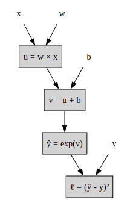
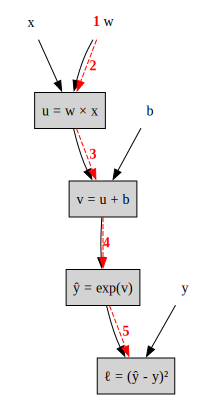
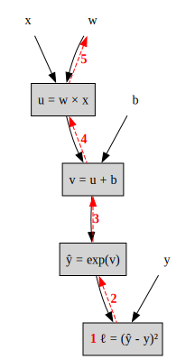
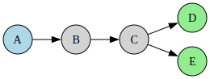
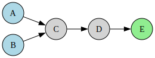

# Automatic Differentiation

## Introduction: The Chain Rule

Machine learning relies heavily on computing gradients to optimize loss functions. Consider a simple loss function:

$$\ell = \left(\exp(wx+b) - y \right)^2$$

where $w$ and $b$ are parameters we want to optimize, $x$ is the input, and $y$ is the target value.

### Computation Graph

We can decompose this computation into elementary operations:

- **Multiplication**: $u = w \times x$
- **Addition**: $v = u + b$
- **Exponential**: $\hat{y} = \exp(u)$
- **Loss**: $\ell = (\hat{y} - y)^2$


```python
import graphviz

dot = graphviz.Digraph()
dot.attr(rankdir='TB')

# Input nodes - no border, no fill
dot.attr('node', shape='plaintext')
for node in [('x', 'x'), ('w', 'w'), ('b', 'b'), ('y', 'y')]:
    dot.node(*node)

# Operation nodes - light gray squares
dot.attr('node', shape='box', style='filled', fillcolor='lightgray')
for node in [('u', 'u = w × x'), ('v', 'v = u + b'), ('yhat', 'ŷ = exp(v)'), ('loss', 'ℓ = (ŷ - y)²')]:
    dot.node(*node)

# Edges
dot.edges([('w', 'u'), ('x', 'u'), ('u', 'v'), ('b', 'v'), ('v', 'yhat'), ('yhat', 'loss'), ('y', 'loss')])

dot
```


    

    


Each operation in this graph is a simple function we know how to differentiate.

### The Chain Rule

To compute the partial derivative, we use the **chain rule**.

$$\frac{\partial \ell}{\partial w} = \frac{\partial \ell}{\partial \hat{y}} \cdot \frac{\partial \hat{y}}{\partial v} \cdot \frac{\partial v}{\partial u} \cdot \frac{\partial u}{\partial w}$$

Let's compute each derivative:

$$
\begin{align*}
\frac{\partial u}{\partial w} &= x & \text{derivative of $w \times x$}\\\\
\frac{\partial v}{\partial u} &= 1 & \text{derivative of $u + b$}\\\\
\frac{\partial \hat{y}}{\partial v} &= \exp(v) = \hat{y} & \text{derivative of $\exp(v)$}\\\\
\frac{\partial \ell}{\partial \hat{y}} &= 2(\hat{y} - y) & \qquad\text{derivative of $(\hat{y} - y)^2$}\\\\
\end{align*}
$$


<!-- 1. $
2. $\frac{\partial \hat{y}}{\partial v} = \exp(v) = \hat{y}$ (derivative of $\exp(v)$)
3. $\frac{\partial v}{\partial u} = 1$ (derivative of $u + b$)
4. $\frac{\partial u}{\partial w} = x$ (derivative of $w \times x$) -->

Therefore:
$$\frac{\partial \ell}{\partial w} = 2(\hat{y} - y) \cdot \hat{y} \cdot 1 \cdot x = 2(\exp(wx+b) - y) \cdot \exp(wx+b) \cdot x$$

Similarly, for $b$:
$$\frac{\partial \ell}{\partial b} = 2(\hat{y} - y) \cdot \hat{y} \cdot 1 = 2(\exp(wx+b) - y) \cdot \exp(wx+b)$$

### Two Modes of Automatic Differentiation

There are two possible modes to implement automatic differentiation: **Forward** and **Backward**
These modes correspond to the two possible ways to compute the chain rule from the computation graph.

- **Forward mode**: Compute derivatives from inputs to outputs
- **Backward mode**: Compute derivatives from outputs to inputs

## Forward-mode differentiation

Forward mode computes derivatives by propagating derivative information **from inputs to outputs** through the computation graph. Let's see how this works on our example.

### Example: Computing $\frac{\partial \ell}{\partial w}$

Recall our computation graph for $\ell = (\exp(wx+b) - y)^2$:
The steps are the following:

$$
\begin{align*}
&\text{1. Initialize:} & \frac{\partial w}{\partial w} &= 1\\\\
\\\\
&\text{2. Multiplication:} & \frac{\partial u}{\partial w} &= \frac{\partial u}{\partial w} \cdot 1 = x \cdot 1 = x\\\\
\\\\
&\text{3. Addition:} & \frac{\partial v}{\partial w} &= \frac{\partial v}{\partial u} \cdot \frac{\partial u}{\partial w} = 1 \cdot x = x\\\\
\\\\
&\text{4. Exponential:} & \frac{\partial \hat{y}}{\partial w} &= \frac{\partial \hat{y}}{\partial v} \cdot \frac{\partial v}{\partial w} = \hat{y} \cdot x\\\\
\\\\
&\text{5. Loss:} & \frac{\partial \ell}{\partial w} &= \frac{\partial \ell}{\partial \hat{y}} \cdot \frac{\partial \hat{y}}{\partial w} = 2(\hat{y}-y) \cdot \hat{y} \cdot x
\end{align*}
$$


```python
from matplotlib import animation
from IPython.display import HTML
import matplotlib.pyplot as plt
import matplotlib.patches as mpatches
import graphviz

# Create the graph structure
dot = graphviz.Digraph()
dot.attr(rankdir='TB')
dot.attr('node', shape='plaintext')
for node in [('x', 'x'), ('b', 'b'), ('y', 'y')]:
    dot.node(*node)
# w node with step 1 label
dot.node('w', '<<B><FONT COLOR="red">1</FONT></B> w>')
dot.attr('node', shape='box', style='filled', fillcolor='lightgray')
for node in [('u', 'u = w × x'), ('v', 'v = u + b'), ('yhat', 'ŷ = exp(v)'), ('loss', 'ℓ = (ŷ - y)²')]:
    dot.node(*node)

# All black plain arrows
dot.edge('w', 'u')
dot.edge('x', 'u')
dot.edge('u', 'v')
dot.edge('b', 'v')
dot.edge('v', 'yhat')
dot.edge('yhat', 'loss')
dot.edge('y', 'loss')

# Forward flow labels with step numbers in red bold font (dashed red arrows on top)
dot.edge('w', 'u', label='<<B><FONT COLOR="red">2</FONT></B>>', style='dashed', color='red')
dot.edge('u', 'v', label='<<B><FONT COLOR="red">3</FONT></B>>', style='dashed', color='red')
dot.edge('v', 'yhat', label='<<B><FONT COLOR="red">4</FONT></B>>', style='dashed', color='red')
dot.edge('yhat', 'loss', label='<<B><FONT COLOR="red">5</FONT></B>>', style='dashed', color='red')

dot
```


    

    


### Summary

- **One pass per input**: To compute $\frac{\partial \ell}{\partial w}$ and $\frac{\partial \ell}{\partial b}$, we need **two forward passes** (one for each parameter)
- **Efficient when**: Few inputs, many outputs (uncommon in deep learning)
- **Implementation**: Dual numbers provide an elegant way to implement forward mode

## Backward-mode differentiation

Backward mode (also called **backpropagation**) computes derivatives by propagating derivative information **from outputs to inputs** through the computation graph. This is the mode used by PyTorch, TensorFlow, and most deep learning frameworks.

**Important**: Backward mode requires **two phases**:
1. **Forward pass**: We compute all intermediate values ($u$, $v$, $\hat{y}$, $\ell$) and **store** them. We need these values (like $\hat{y}$, $x$) to compute the local derivatives during the backward pass.
2. **Backward pass**: Then, we propagate gradients from the output back to the inputs using the stored values.

### Example: Computing $\frac{\partial \ell}{\partial w}$

Using the same computation graph for $\ell = (\exp(wx+b) - y)^2$:

**Forward pass** (compute and store): $u = wx$, $v = u+b$, $\hat{y} = \exp(v)$, $\ell = (\hat{y}-y)^2$

**Backward pass** steps:

$$
\begin{align*}
&\text{1. Initialize:} & \frac{\partial \ell}{\partial \ell} &= 1\\\\
\\\\
&\text{2. Loss:} & \frac{\partial \ell}{\partial \hat{y}} &= \frac{\partial \ell}{\partial \ell} \cdot \frac{\partial \ell}{\partial \hat{y}} = 1 \cdot 2(\hat{y}-y) = 2(\hat{y}-y)\\\\
\\\\
&\text{3. Exponential:} & \frac{\partial \ell}{\partial v} &= \frac{\partial \ell}{\partial \hat{y}} \cdot \frac{\partial \hat{y}}{\partial v} = 2(\hat{y}-y) \cdot \hat{y}\\\\
\\\\
&\text{4. Addition:} & \frac{\partial \ell}{\partial u} &= \frac{\partial \ell}{\partial v} \cdot \frac{\partial v}{\partial u} = 2(\hat{y}-y) \cdot \hat{y} \cdot 1\\\\
\\\\
&\text{5. Multiplication:} & \frac{\partial \ell}{\partial w} &= \frac{\partial \ell}{\partial u} \cdot \frac{\partial u}{\partial w} = 2(\hat{y}-y) \cdot \hat{y} \cdot x
\end{align*}
$$


```python
import graphviz

# Create the graph structure for backward mode
dot = graphviz.Digraph()
dot.attr(rankdir='TB')
dot.attr('node', shape='plaintext')
for node in [('x', 'x'), ('w', 'w'), ('b', 'b'), ('y', 'y')]:
    dot.node(*node)
dot.attr('node', shape='box', style='filled', fillcolor='lightgray')
for node in [('u', 'u = w × x'), ('v', 'v = u + b'), ('yhat', 'ŷ = exp(v)')]:
    dot.node(*node)
# loss node with step 1 label
dot.node('loss', '<<B><FONT COLOR="red">1</FONT></B> ℓ = (ŷ - y)²>')

# Edges with forward flow (no labels)
dot.edge('w', 'u')
dot.edge('x', 'u')
dot.edge('u', 'v')
dot.edge('b', 'v')
dot.edge('v', 'yhat')
dot.edge('yhat', 'loss')
dot.edge('y', 'loss')

# Add backward flow labels with step numbers in red bold font (reversed arrows)
dot.edge('yhat', 'loss', label='<<B><FONT COLOR="red">2</FONT></B>>', style='dashed', color='red', dir='back')
dot.edge('v', 'yhat', label='<<B><FONT COLOR="red">3</FONT></B>>', style='dashed', color='red', dir='back')
dot.edge('u', 'v', label='<<B><FONT COLOR="red">4</FONT></B>>', style='dashed', color='red', dir='back')
dot.edge('w', 'u', label='<<B><FONT COLOR="red">5</FONT></B>>', style='dashed', color='red', dir='back')

dot
```


    

    


### Summary

- **One pass for all inputs**: To compute $\frac{\partial \ell}{\partial w}$ and $\frac{\partial \ell}{\partial b}$, we need **only one backward pass** (computes gradients for all parameters at once)
- **Efficient when**: Many inputs, few outputs (common in deep learning - millions of parameters, one loss)

## Forward vs Backward: Computational Efficiency

The choice between forward and backward mode depends on the ratio of inputs to outputs in the computation graph.

### Case 1: One Input, Multiple Outputs (Forward Mode Wins)


```python
import graphviz

# Case 1: One input, multiple outputs
dot1 = graphviz.Digraph()
dot1.attr(rankdir='LR')

dot1.attr('node', shape='circle', style='filled', fillcolor='lightblue')
dot1.node('A', 'A')

dot1.attr('node', fillcolor='lightgray')
for node in [('B', 'B'), ('C', 'C')]:
    dot1.node(*node)
    
dot1.attr('node', fillcolor='lightgreen')
for node in [('D', 'D'), ('E', 'E')]:
    dot1.node(*node)

dot1.edges([('A', 'B'), ('B', 'C'), ('C', 'D'), ('C', 'E')])

dot1
```


    

    


To compute $\frac{\partial D}{\partial A}$ and $\frac{\partial E}{\partial A}$:

- **Forward mode**: One pass through A→B→C, then branch to D and E
- **Backward mode**: Two separate passes (D→C→B→A and E→C→B→A)

### Case 2: Multiple Inputs, One Output (Backward Mode Wins)


```python
import graphviz

# Case 2: Multiple inputs, one output
dot2 = graphviz.Digraph()
dot2.attr(rankdir='LR')

dot2.attr('node', shape='circle', style='filled', fillcolor='lightblue')
for node in [('A', 'A'), ('B', 'B')]:
    dot2.node(*node)

dot2.attr('node', fillcolor='lightgray')
for node in [('C', 'C'), ('D', 'D')]:
    dot2.node(*node)
    
dot2.attr('node', fillcolor='lightgreen')
dot2.node('E', 'E')

dot2.edges([('A', 'C'), ('B', 'C'), ('C', 'D'), ('D', 'E')])

dot2
```


    

    


To compute $\frac{\partial E}{\partial A}$ and $\frac{\partial E}{\partial B}$:

- **Forward mode**: Two separate passes (A→C→D→E and B→C→D→E)
- **Backward mode**: One pass through E→D→C, then branch to A and B

### Why Deep Learning Uses Backward Mode

Neural networks typically have:
- **Many (many) parameters** (inputs to the gradient computation)
- **One scalar loss** (single output)

Backward mode computes all parameter gradients in one pass. Forward mode would require one pass per parameter.

This is why PyTorch, TensorFlow, and all deep learning frameworks use backward mode (backpropagation).


